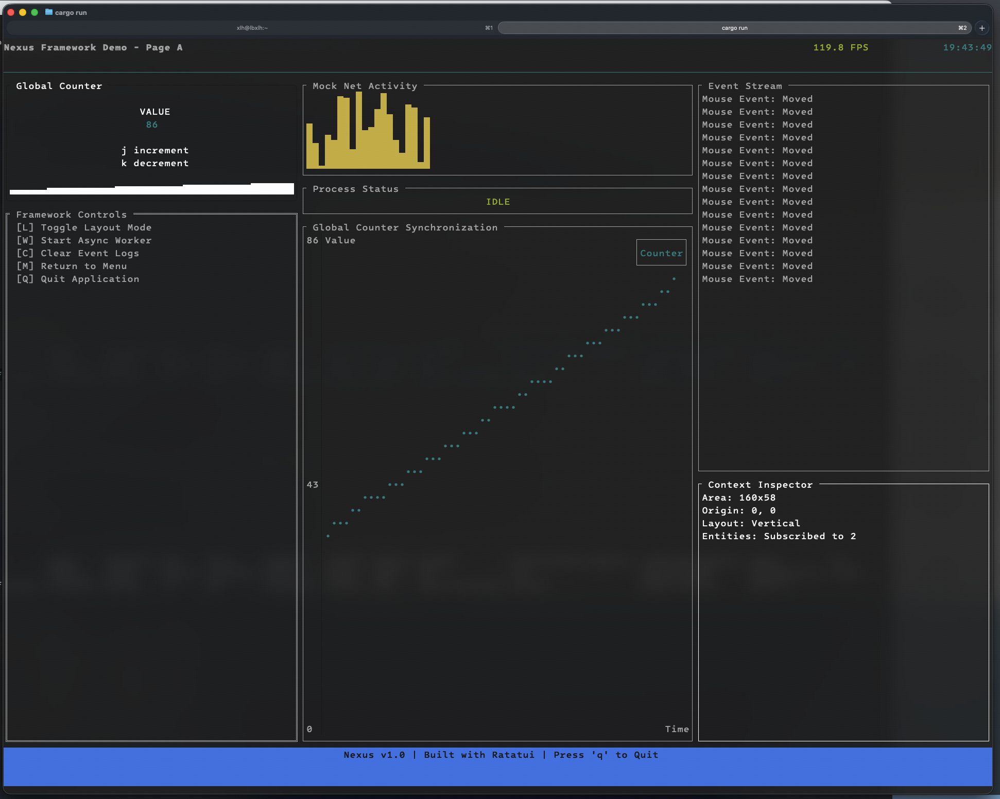

# Rat-Nexus

一个现代化的 Rust TUI 框架，受 [GPUI](https://github.com/zed-industries/zed) 启发，基于 [Ratatui](https://github.com/ratatui-org/ratatui) 构建。

[](https://opensource.org/licenses/MIT)



## 为什么选择 Rat-Nexus？

构建复杂的 TUI 应用时，你可能会遇到这些问题：

- **状态管理混乱** — 手动传递状态，难以追踪变更
- **生命周期不清晰** — 不知道何时初始化、何时清理
- **异步任务泄漏** — 后台任务无法取消，组件销毁后仍在运行
- **路由硬编码** — 字符串路由容易拼写错误

Rat-Nexus 通过提供 **响应式状态**、**清晰的生命周期**、**可取消的任务** 和 **类型安全路由** 来解决这些问题。

## 安装

在 `Cargo.toml` 中添加依赖：

```toml
[dependencies]
rat-nexus = { path = "rat-nexus" }
ratatui = "0.29"
crossterm = "0.28"
tokio = { version = "1", features = ["full"] }
anyhow = "1"
```

## 快速开始

一个最简单的计数器：

```rust
use crossterm::event::KeyCode;
use rat_nexus::{Action, Application, Component, Context, Entity, Event, EventContext};
use ratatui::{
    layout::{Alignment, Constraint, Layout},
    style::{Color, Stylize},
    widgets::{Block, BorderType, Paragraph},
};
use std::sync::{Arc, Mutex};

// 1. 定义状态
struct CounterState {
    count: i32,
}

// 2. 定义组件
struct Counter {
    state: Entity<CounterState>,
}

// 3. 实现 Component trait
impl Component for Counter {
    fn render(&mut self, frame: &mut ratatui::Frame, cx: &mut Context<Self>) {
        // watch = subscribe + read，状态变更时自动重渲染
        let count = cx.watch(&self.state, |s| s.count).unwrap_or(0);

        let area = Layout::vertical([
            Constraint::Fill(1),
            Constraint::Length(5),
            Constraint::Fill(1),
        ])
        .split(frame.area())[1];

        let area = Layout::horizontal([
            Constraint::Fill(1),
            Constraint::Length(30),
            Constraint::Fill(1),
        ])
        .split(area)[1];

        frame.render_widget(
            Paragraph::new(format!("Count: {count}"))
                .alignment(Alignment::Center)
                .block(Block::bordered().title(" Counter ").border_type(BorderType::Rounded)),
            area,
        );
    }

    fn handle_event(&mut self, event: Event, _cx: &mut EventContext<Self>) -> Option<Action> {
        if let Event::Key(key) = event {
            match key.code {
                KeyCode::Char('j') => { self.state.update(|s| s.count += 1); }
                KeyCode::Char('k') => { self.state.update(|s| s.count -= 1); }
                KeyCode::Char('q') => return Some(Action::Quit),
                _ => {}
            }
        }
        None
    }
}

// 4. 启动应用
fn main() -> anyhow::Result<()> {
    Application::new().run(|cx| {
        let state = cx.new_entity(CounterState { count: 0 });
        cx.set_root(Arc::new(Mutex::new(Counter { state })))?;
        Ok(())
    })
}
```

## 核心概念

### Entity：响应式状态

`Entity<T>` 是状态的容器，当状态变更时自动通知订阅者：

```rust
// 创建
let state = cx.new_entity(MyState::default());

// 更新（自动触发重渲染）
state.update(|s| s.counter += 1);

// 读取
let value = state.read(|s| s.counter).unwrap();

// 订阅 + 读取（推荐在 render 中使用）
let value = cx.watch(&state, |s| s.counter).unwrap();
```

### Component：组件生命周期

```rust
impl Component for MyPage {
    /// 首次挂载，只调用一次
    /// 适合：启动后台任务、初始化资源
    fn on_mount(&mut self, cx: &mut Context<Self>) {
        let handle = cx.spawn_task(|app| async move {
            loop {
                // 定时刷新...
                app.refresh();
                tokio::time::sleep(Duration::from_secs(1)).await;
            }
        });
        self.tasks.track(handle);
    }

    /// 每次进入视图
    /// 适合：重置临时状态、刷新数据
    fn on_enter(&mut self, _cx: &mut Context<Self>) {
        // ...
    }

    /// 离开视图
    /// 适合：暂停任务、保存状态
    fn on_exit(&mut self, _cx: &mut Context<Self>) {
        self.tasks.abort_all();
    }

    /// 应用退出前
    /// 适合：持久化、清理资源
    fn on_shutdown(&mut self, _cx: &mut Context<Self>) {
        // ...
    }

    fn render(&mut self, frame: &mut ratatui::Frame, cx: &mut Context<Self>) {
        // 使用 frame.area() 获取渲染区域
    }

    fn handle_event(&mut self, event: Event, cx: &mut EventContext<Self>) -> Option<Action> {
        None
    }
}
```

### TaskTracker：可取消的异步任务

避免任务泄漏，组件销毁时自动清理：

```rust
use rat_nexus::TaskTracker;

struct MyComponent {
    tasks: TaskTracker,
}

impl Component for MyComponent {
    fn on_mount(&mut self, cx: &mut Context<Self>) {
        // spawn_task 返回可取消的 TaskHandle
        let handle = cx.spawn_task(|app| async move {
            loop {
                app.refresh();
                tokio::time::sleep(Duration::from_millis(100)).await;
            }
        });

        // 追踪任务
        self.tasks.track(handle);
    }

    fn on_exit(&mut self, _cx: &mut Context<Self>) {
        // 取消所有任务
        self.tasks.abort_all();
    }
}

// TaskTracker 实现了 Drop，析构时自动 abort_all()
```

### Router：类型安全路由

编译时检查路由名称，告别拼写错误：

```rust
use rat_nexus::{define_routes, Router};

// 定义路由枚举
define_routes! {
    Menu,
    Counter,
    Settings,
    Snake,
}

// 使用
let mut router = Router::new(Route::Menu);

router.navigate(Route::Counter);  // 编译时类型检查

if router.can_go_back() {
    router.go_back();
}

match router.current() {
    Route::Menu => { /* ... */ }
    Route::Counter => { /* ... */ }
    _ => {}
}
```

## API 参考

### Context 方法

| 方法 | 说明 |
|------|------|
| `cx.watch(&entity, \|s\| ...)` | 订阅并读取状态 |
| `cx.subscribe(&entity)` | 仅订阅状态变更 |
| `cx.spawn(f)` | 启动后台任务（不可取消） |
| `cx.spawn_task(f)` | 启动后台任务（返回 TaskHandle） |
| `cx.notify()` | 手动触发重渲染 |
| `cx.cast::<U>()` | 转换 Context 类型 |
| `cx.app` | 访问 AppContext |

### Component 生命周期

| 方法 | 调用时机 | 用途 |
|------|---------|------|
| `on_mount` | 首次挂载（仅一次） | 启动后台任务 |
| `on_enter` | 每次进入视图 | 刷新数据 |
| `on_exit` | 离开视图 | 暂停/取消任务 |
| `on_shutdown` | 应用退出 | 持久化/清理 |
| `render` | 每次重渲染 | 绘制 UI |
| `handle_event` | 收到事件 | 处理输入 |

### 完整导出

```rust
pub use rat_nexus::{
    // 应用
    Application, AppContext, Context, EventContext,
    // 组件
    Component, Event, Action, AnyComponent,
    // 状态
    Entity, WeakEntity,
    // 路由
    Router, define_routes,
    // 任务
    TaskHandle, TaskTracker,
    // 错误
    Error, Result,
};
```

## 运行示例

```bash
# 运行 demo
cargo run

# 操作
# ↑/↓/Enter - 导航菜单
# j/k       - 增减计数器
# w         - 启动异步任务
# m         - 返回菜单
# q         - 退出

# 贪吃蛇
# ←↑↓→/wasd - 移动
# Space     - 暂停
# r         - 重新开始
```

## 项目结构

```
.
├── rat-nexus/              # 核心框架
│   └── src/
│       ├── application.rs  # Application, Context, AppContext
│       ├── component/      # Component trait
│       ├── state/          # Entity 响应式状态
│       ├── router/         # Router, define_routes!
│       ├── task.rs         # TaskHandle, TaskTracker
│       └── lib.rs          # 公开 API
│
└── rat-demo/               # 示例应用
    └── src/
        ├── pages/          # 页面组件
        ├── app.rs          # 根组件
        └── main.rs         # 入口
```

## License

MIT
